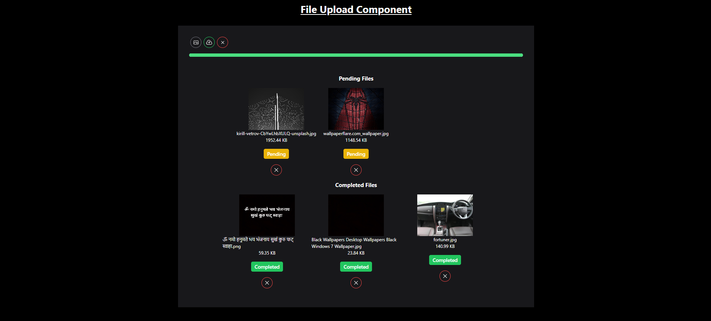

# File Upload Component

This File Upload supports automatic, basic, and advanced file upload types, with features like notifications, drag-and-drop, file size validation, and progress tracking.

## Features

- **Multiple Upload Types**:

  - **Basic**: Select and upload a single file.
  - **Auto**: Automatically uploads files when selected.
  - **Advanced**: Allows multiple file uploads with drag-and-drop functionality, file size checks, and progress tracking.

- **File Size Validation**: Ensures that the total size of uploaded files does not exceed 3MB.

- **Upload Notifications**: Displays a success message upon successful upload.

- **File Preview**: Displays a preview of images or thumbnails for files that support it.

- **Dynamic Progress Bar**: Shows the progress of the file upload (for advanced upload).

- **Error Handling**: Shows error messages for invalid file uploads or when the total file size exceeds the limit.

