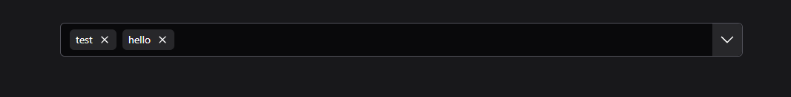
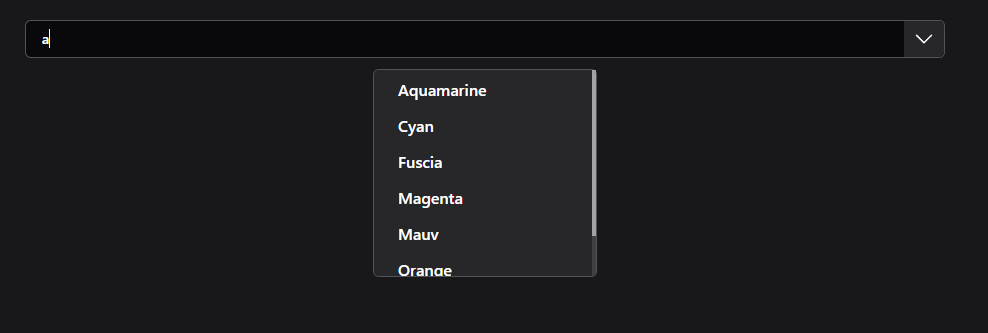
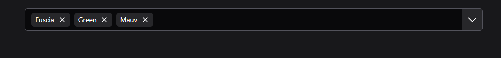

# Character Auto Complete
  The component provides an interactive UI for searching, selecting, and managing a list of items with features like typeahead suggestions, multi-select, and notifications.

## Features

- **Typeahead Input:** Provides real-time suggestions as you type.
- **Multi-select Support:** Allows selection of multiple items.
- **Notification Popup:** Displays notifications when actions like form submission are performed.
- **No Results Message:** Indicates when no matching results are found.
- **Dropdown Toggle:** Shows all items when clicked.
- **Chip Display:** Selected items are displayed as removable chips.
- **Dynamic Data Management:** Items can be dynamically added to the list if not already present.

