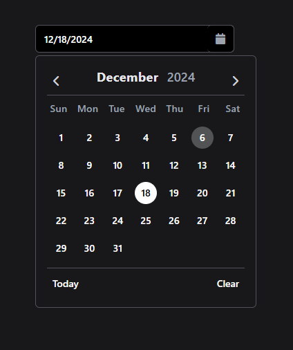
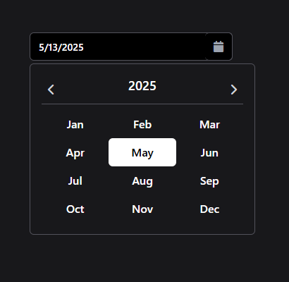
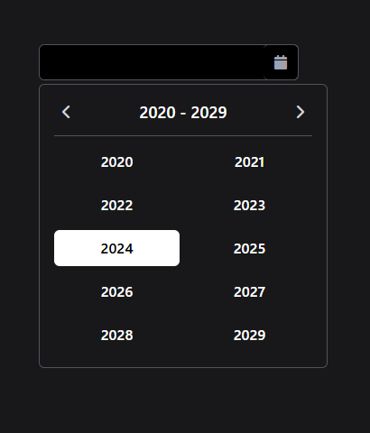
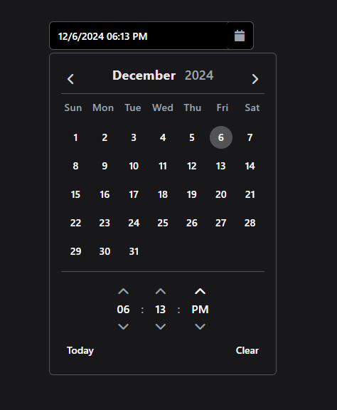
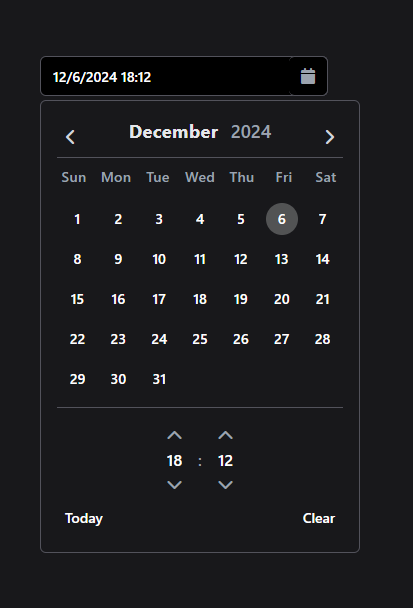
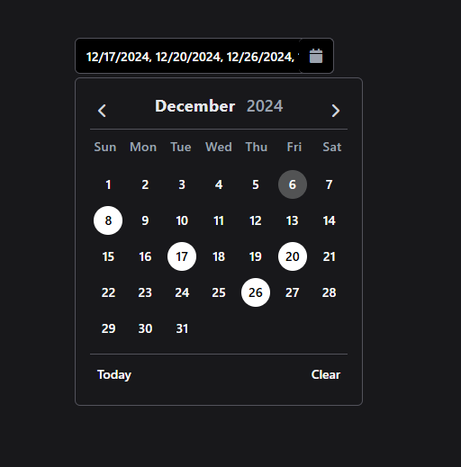
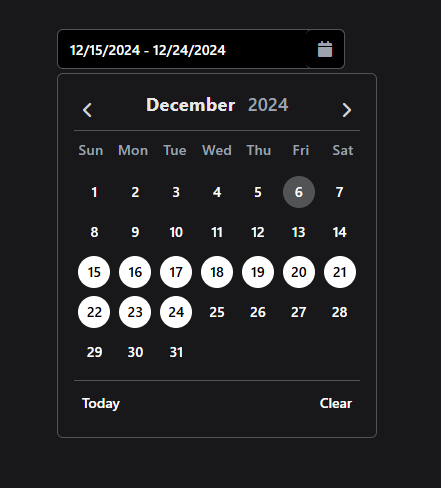

# Date Picker Component

## Overview
This Date Picker component is built using Alpine.js and Tailwind CSS, providing a sleek and modern interface for selecting dates and times. It supports single date selection, multiple date selection, and date range selection, along with an optional time picker feature.

## Features
- **Date Selection**: Choose a single date, multiple dates, or a range of dates.
- **Time Picker**: Optionally select hours and minutes, with support for both 12-hour and 24-hour formats.
- **Responsive Design**: The component is styled using Tailwind CSS, ensuring it looks great on all devices.
- **Calendar Navigation**: Easily navigate between months and years.
- **Today and Clear Buttons**: Quickly reset the date picker to today’s date or clear the selected date(s).

