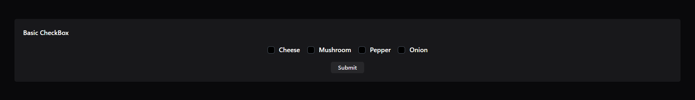
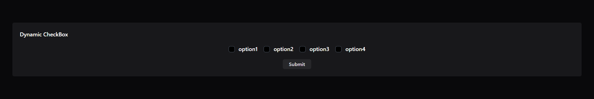
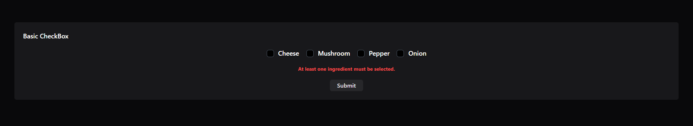
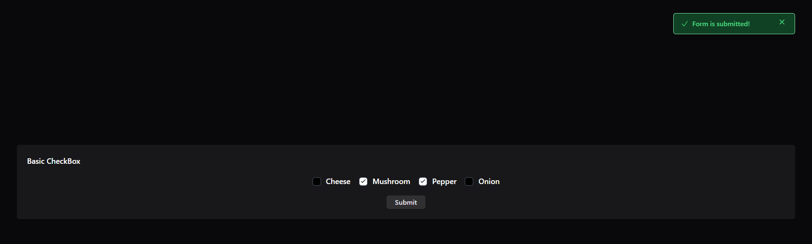

# Checkbox Form Component with Alpine.js and Tailwind CSS

This is a customizable checkbox form component using **Alpine.js** for interactivity and **Tailwind CSS** for styling. The component allows users to select checkboxes with custom icons and provides a dynamic notification feature upon form submission.

## Features

- **Checkbox Types:**
  - **Basic Checkbox:** Displays static checkboxes with options like "Cheese," "Mushroom," "Pepper," and "Onion."
  - **Dynamic Checkbox:** Displays checkboxes dynamically based on data passed in a JavaScript array.

- **Icons:** Each checkbox has an icon (checkmark) that appears when the checkbox is selected.

- **Notification:** Upon form submission, a notification is shown confirming the submission or displaying an error message if no checkboxes are selected.

- **Responsiveness:** Fully responsive design built with Tailwind CSS, ensuring the form works well on various screen sizes.

