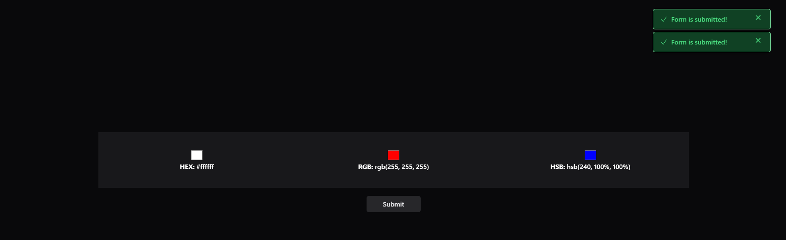

# Color Picker Form Component

The component uses **Tailwind CSS** for styling and **Alpine.js** for handling interactivity and state management.

## Features

- **Three color pickers**: Each picker's color value is displayed in real-time in different formats (HEX, RGB, and HSB).
- **Real-time color updates**: As you select a color from each picker, the corresponding color format is updated immediately.
- **Submit button**: After selecting colors, users can click a "Submit" button which triggers a notification indicating the form submission.
- **Notification System**: A notification appears on the screen when the form is submitted and disappears after a few seconds.

