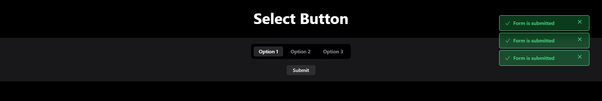

# Select Button Component

The component allows users to select one or more options from predefined buttons, with real-time feedback, error handling, and notifications.

---
## Features

1. **Dynamic Button Selection**:
   - Supports single and multiple selections.
   - Highlights selected buttons dynamically.
2. **Error Handling**:
   - Displays an error message if no option is selected when submitting.
3. **Notifications**:
   - Displays success notifications upon form submission.
   - Allows dismissing notifications.
4. **Customizable State**:
   - Enable/disable buttons dynamically based on conditions.
5. **Mobile-Friendly Design**:
   - Fully responsive with Tailwind CSS.

