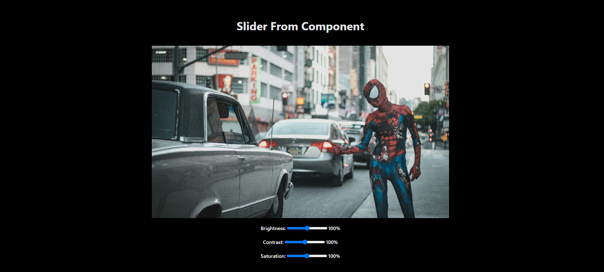

# Slider Component with Filters and Notifications

This is a range slider, image filter adjustments, and notification system.

## Features

### 1. Multi and Single Range Sliders

- **Multiple Range Slider**:
  - Allows the user to set a range with `From` and `To` values.
  - Supports drag-and-drop functionality for both slider handles.
- **Single Range Slider**:
  - Adjust a single value with optional step adjustments.
  - Displays error messages when constraints are not met.

### 2. Image Filter Adjustments

- Dynamically update the brightness, contrast, and saturation of an image using sliders.

### 3. Notifications

- Displays success notifications on form submission.
- Includes a timeout-based auto-dismiss for notifications.

