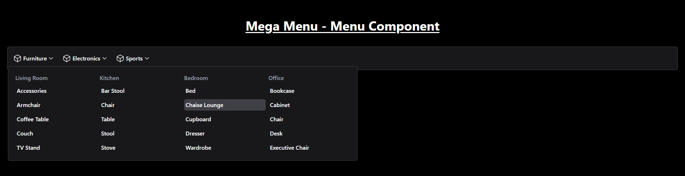
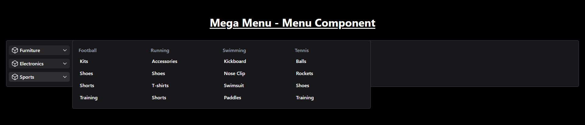
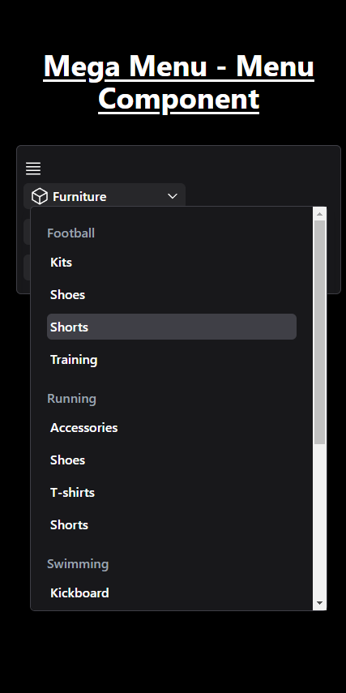

# Mega Menu - Responsive Navigation Component

A responsive mega menu component built using Tailwind CSS and Alpine.js for easy implementation and interactive functionality. The menu is designed to be used as a navigation bar for websites with a large number of categories and subcategories. It includes a hamburger menu for smaller screens, which is hidden on medium and larger screens.

## Features

- **Responsive Design**: Automatically adjusts the layout for different screen sizes (small, medium, and large).
- **Mega Menu**: Allows for displaying subcategories on hover or click.
- **Hamburger Menu**: Visible only on mobile (below `md` breakpoint), toggling the mega menu.

