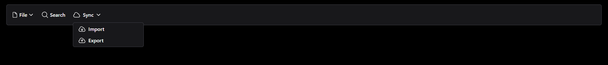
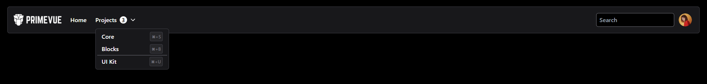
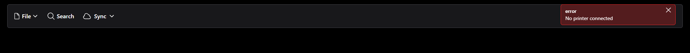

# Menubar Component

This Menubar Component showcases a feature-rich navigation bar with different types of menus, dropdowns, and submenus for a modern web application.

---

## Features

- **Basic Menu:** A simple horizontal menu with hover effects.
- **Template Menu:** Advanced layout including a project counter and a search bar.
- **Command Menu:** Dropdown-based command-like interface.
- **Interactive Submenus:** Multi-level submenus with hover and click interactions.

