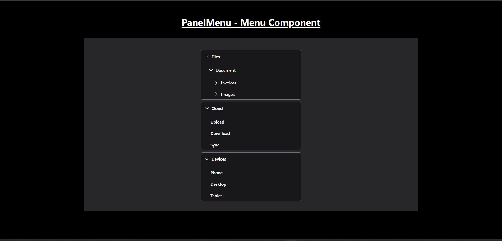
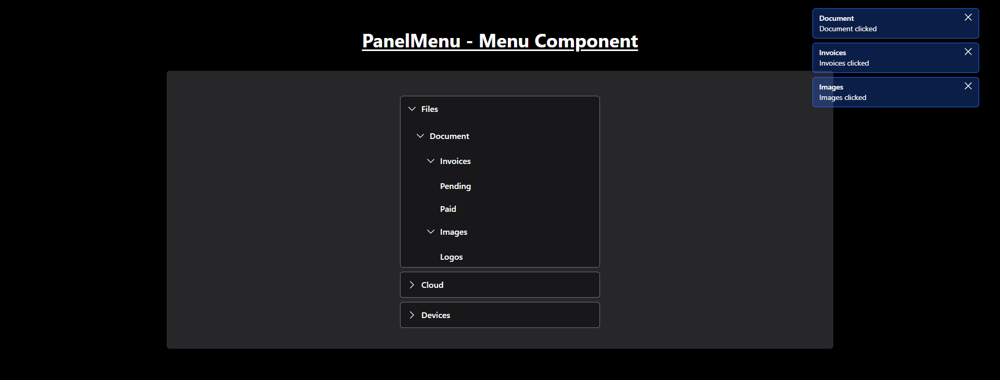

# PanelMenu - Menu Component

## Description

The menu supports multi-level nesting, notifications, and flexible selection modes (single or multiple). It's designed for applications that require an interactive and hierarchical navigation system.

---

## Features

- **Multi-Level Menu:** Supports an unlimited number of nested menus.
- **Selection Modes:**
  - Single: Only one parent menu can be open at a time.
  - Multiple: Multiple parent and child menus can be open simultaneously.
- ## **Dynamic Notifications:** Displays a notification when a menu or submenu item is clicked.

