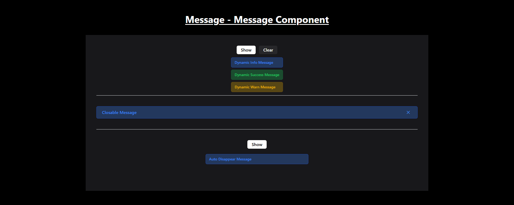

# Message Component with Alpine.js and Tailwind CSS

This Message Component includes different types of messages such as dynamic, closable, and auto-disappearing messages.

## Features

- **Dynamic Messages**: Displays a set of messages that can be shown or hidden based on user interaction.
- **Closable Messages**: A message that can be closed by clicking a close button.
- **Auto Disappear Messages**: A message that will automatically disappear after a few seconds.

