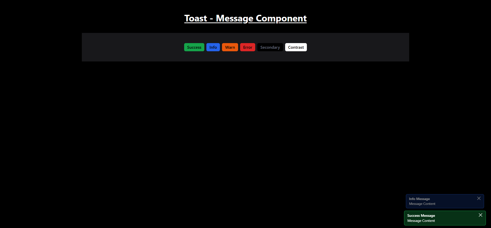

# Toast Notification Component

Toast Notification component allows users to display toast messages with different styles, automatically disappearing after a set duration. It supports both single and multiple notification modes.

---

## Features

- **Notification Types**:
  - Success
  - Info
  - Warn
  - Error
  - Secondary
  - Contrast
- **Multiple Notifications Mode**: Displays all types of notifications together.
- **Single Notification Mode**: Displays only the clicked notification.
- **Auto-Hide**: Notifications disappear automatically after 2 seconds.
- **Manual Dismissal**: Close button for manually removing notifications.
- **Configurable Positions**: Top-right, top-left, bottom-right, or bottom-left.

