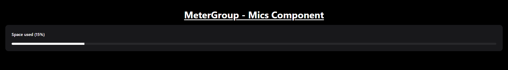
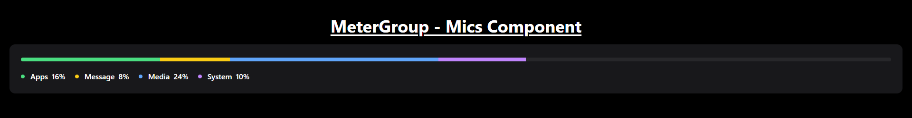

# MeterGroup - Mics Component

A dynamic progress meter supports both basic and multiple progress bars, with an optional vertical orientation.

## Features

- **Basic Progress Meter**: Displays a single progress bar.
- **Multiple Progress Meters**: Displays multiple progress bars with customizable names and colors.
- **Orientation**: Supports both horizontal and vertical orientations for multiple progress meters.

