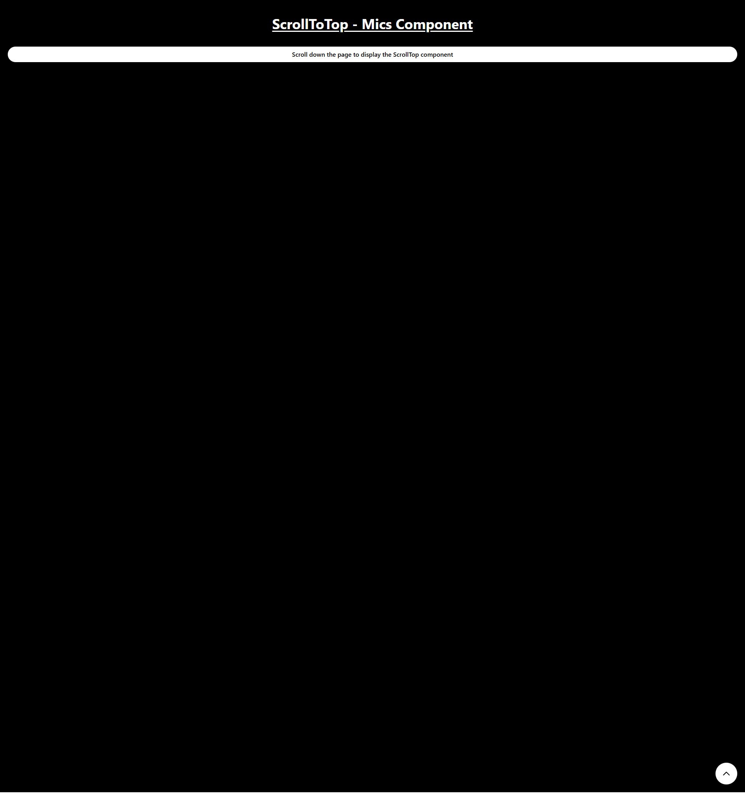

# ScrollToTop - Mics Component

This is a simple web component that displays a "Scroll to Top" button when the user scrolls down the page. The button smoothly scrolls the page back to the top when clicked.

## Features

- **Scroll Detection**: The button appears after scrolling down 200 pixels.
- **Smooth Scroll**: Smoothly scrolls to the top when the button is clicked.

