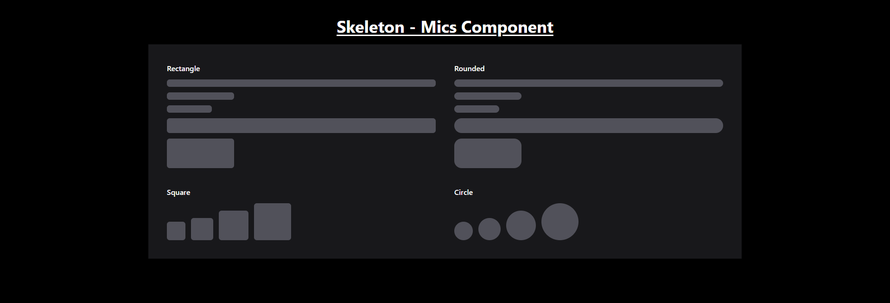

# Skeleton - Mics Component

The skeleton loader is designed for placeholders while content is being loaded.

## Features

- **Rectangle Skeletons:** Different width and height rectangles with animation.
- **Rounded Skeletons:** Circular placeholders with animation.
- **Square Skeletons:** Squares of varying sizes.
- **Circle Skeletons:** Perfect circles of varying sizes.
- **Animation:** `animate-pulse` class for smooth pulsing effects.

