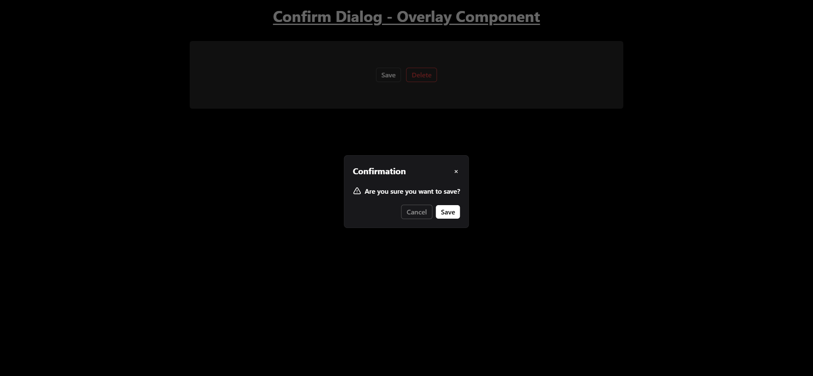

# Confirm Popup - Panel Component

The popup appears when the user clicks on the "Save" or "Delete" buttons. Notifications are displayed based on the user's action, such as confirming or canceling the operation.

## Features

- **Confirmation Dialog**: Displays a confirmation dialog when the user clicks on "Save" or "Delete."
- **Dynamic Notifications**: Notifications show up to inform the user about the action result (confirmed or rejected).

