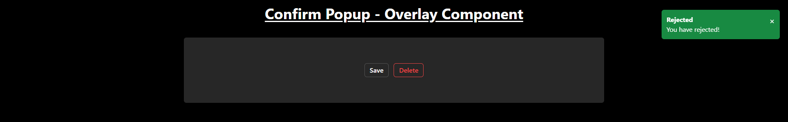

# Confirm Popup - Panel Component

The popup appears when a user clicks on the "Save" or "Delete" buttons, and notifications are shown to reflect the outcome of the action (confirmed or rejected).

## Features

- **Confirmation Dialog**: When the user clicks "Save" or "Delete", a confirmation dialog appears with the option to accept or cancel the action.
- **Dynamic Notifications**: Displays notifications based on the result of the action (e.g., confirming or rejecting the action).

