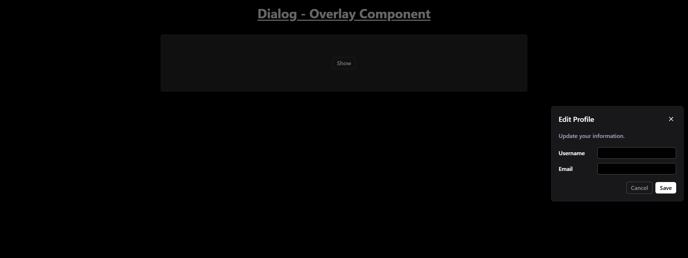

# Dialog - Panel Component

The dialog can be triggered by clicking a button, and it supports various positions (top, bottom, left, right, and center) to display the dialog box.

## Features

- **Customizable Dialog Positions**: The dialog can appear in various positions on the screen (top, bottom, left, right, center).
- **Interactive Form**: The dialog contains a simple form where users can input their username and email.

