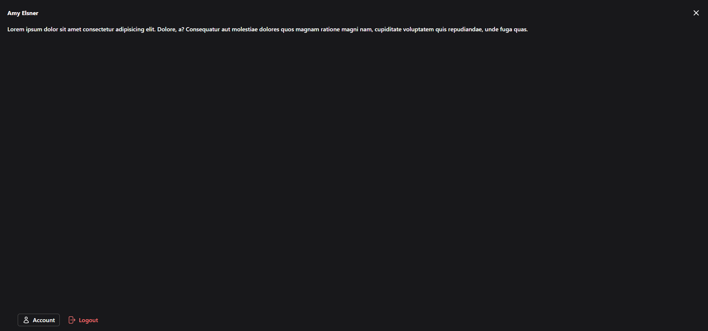
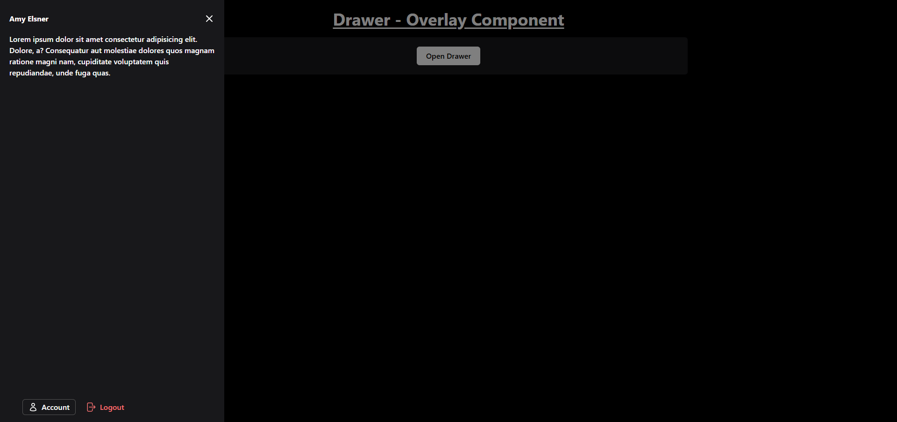

# Drawer - Overlay Component

The drawer supports multiple positions (`left`, `right`, `top`, `bottom`, and `full-screen`) and includes smooth transitions for a modern UI experience.

## Features

- **Overlay:** A semi-transparent background that appears when the drawer is open.
- **Dynamic Positions:** The drawer can be positioned on the left, right, top, bottom, or as a full-screen overlay.
- **Transitions:** Smooth slide-in and slide-out animations for all positions.
- **Close Interactions:** Close the drawer by clicking outside or on the close button.

