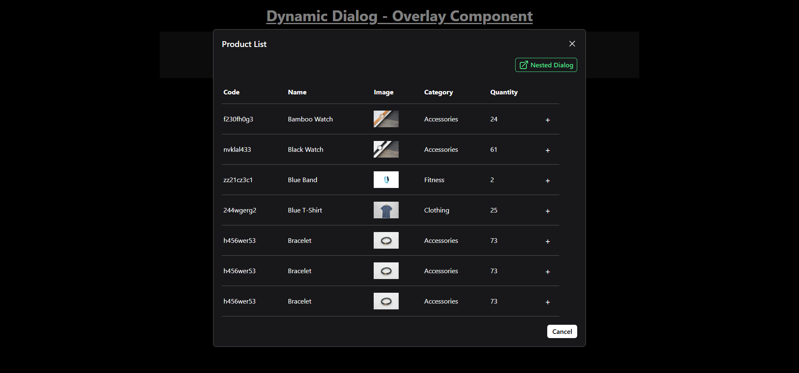
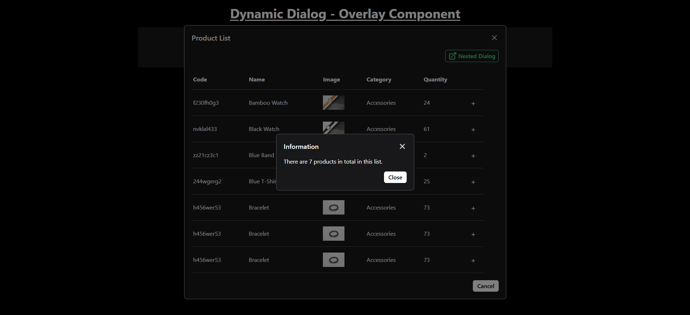
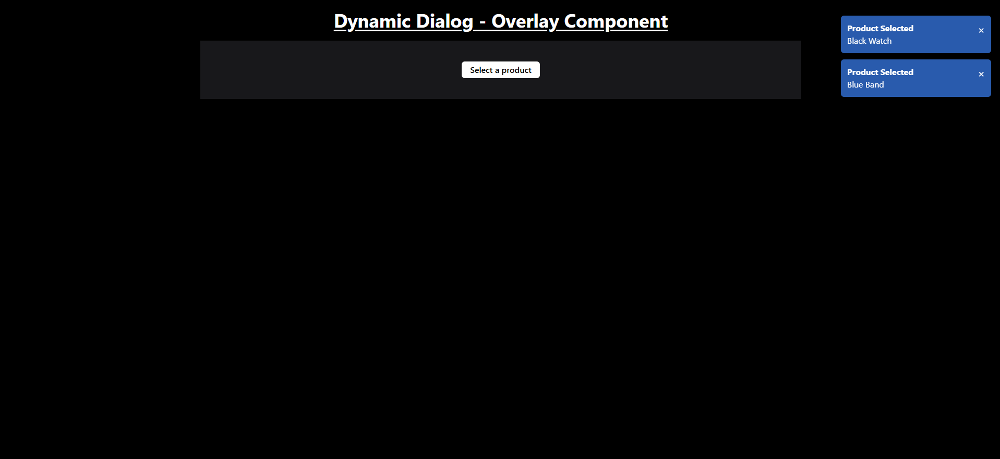

# Dynamic Dialog - Overlay Component

Dynamic Dialog box features an interactive product list displayed in a modal dialog, a nested modal dialog, and notifications. The components include draggable dialogs, an overlay to dim the background, and the ability to select products.

## Features

- **Dynamic Dialog**: Displays a modal dialog with a list of products. The dialog can be opened and closed with a button.
- **Nested Dialog**: A secondary modal dialog that can be opened within the primary dialog, with the ability to display more detailed information.
- **Product Table**: Displays a list of products in a table format, with columns for code, name, image, category, and quantity.
- **Draggable Dialogs**: Both the main dialog and the nested dialog can be dragged around the screen for better user interaction.
- **Notifications**: A notification system that alerts users when they select or cancel a product.

