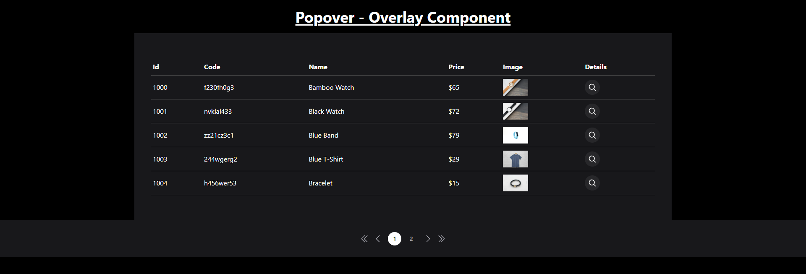
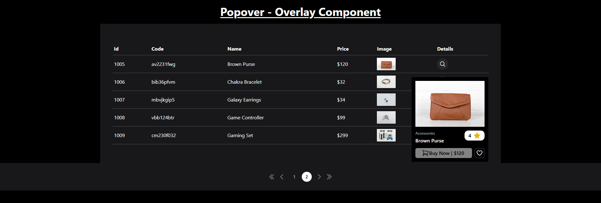

# Overlay Component - Popover

The Overlay Component is a responsive popover. It utilizes Alpine.js for interactivity and Tailwind CSS for styling, providing a modern and sleek user interface.

## Features

- **Dynamic Popover**: Toggle the visibility of the popover to share links or invite members.
- **Copy to Clipboard**: Easily copy the shareable link to the clipboard with a notification.
- **User List**: Display a list of team members with their details and types.
- **Data Table**: View product details in a paginated table format.
- **Responsive Design**: The component is designed to be responsive and works well on various screen sizes.

