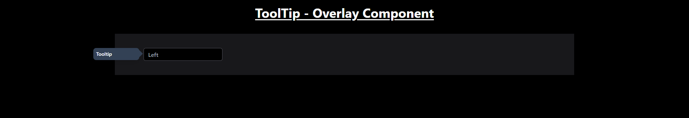

# Tooltip Overlay Component

This component provides a user-friendly way to display tooltips on input fields.

## Features

- Customizable tooltip position (top, bottom, left, right)
- Smooth transitions for showing and hiding tooltips

