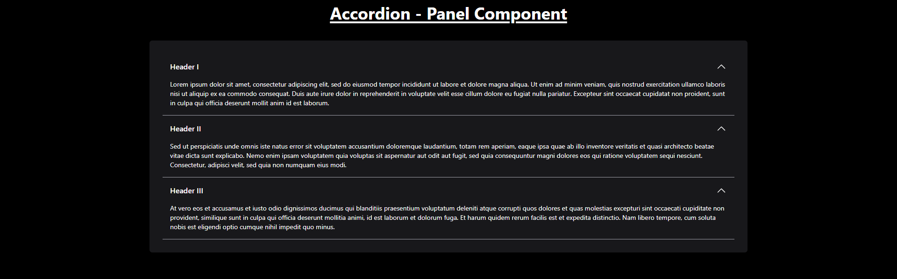
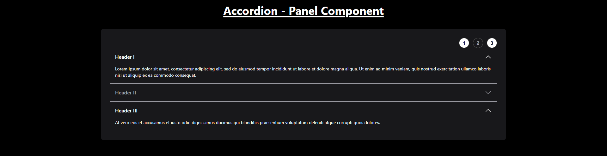

# Dynamic Accordion Component

The accordion supports single and multiple panel modes, with the ability to disable panels. Disabled panels cannot be toggled or interacted with.

## Features

- **Single or Multiple Panel Modes**: Choose whether only one panel can be opened at a time or multiple panels can be expanded.
- **Disable Panels**: Panels can be marked as disabled, which prevents them from being toggled or interacted with.
- **Control Buttons**: Buttons can control which panel is opened, and they also respect the disabled state of panels.
-

