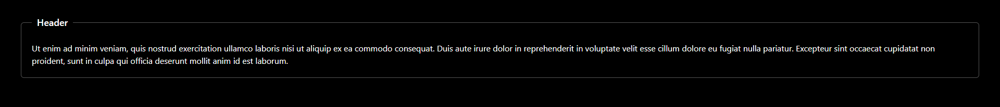
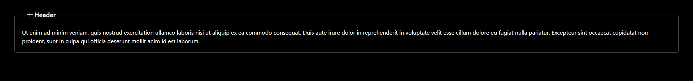

# Fieldset - Panel Component

This FieldSet component is designed to display a collapsible panel, where the content of the fieldset can be toggled open and closed. It also supports the ability to disable the toggle functionality based on the `toggleAble` property.

## Features

- **Collapsible Panels**: The fieldset panel can be expanded or collapsed when clicking the header.
- **Conditional Toggle**: The panel can be conditionally toggled based on the `toggleAble` property.
- **Smooth Transitions**: The panel opens and closes with a smooth animation.

  
  
