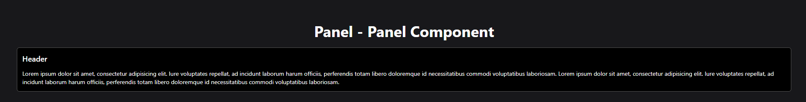
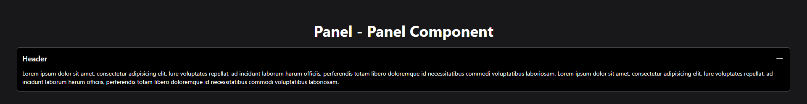

# Panel Component

The component features a collapsible section where content can be toggled on and off.

## Features

- **Collapsible Panel**: The panel has a header with a button that toggles the visibility of its content.

