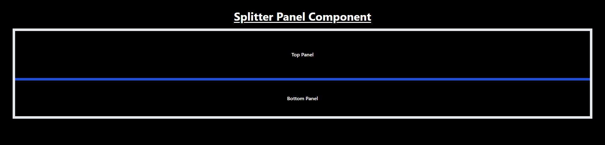

# Resize - Panel Component

This is a resizable panel component which have feature of horizontal,vertical and nested layout resizing option.

## Features

- **Horizontal Resizing**: Adjust the width of adjacent panels.
- **Vertical Resizing**: Adjust the height of stacked panels.
- **Nested Layout**: A combination of horizontal and vertical resizing for advanced layouts.
- **Drag and Resize**: Panels can be resized using mouse drag.

