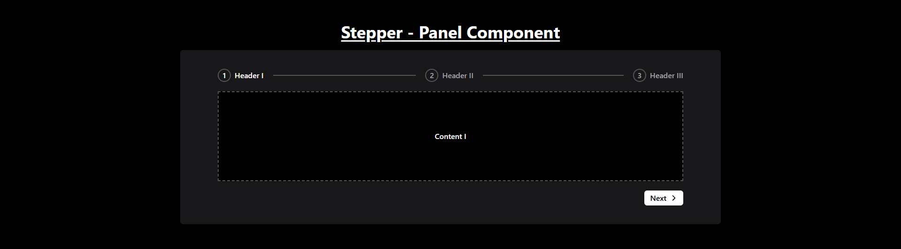
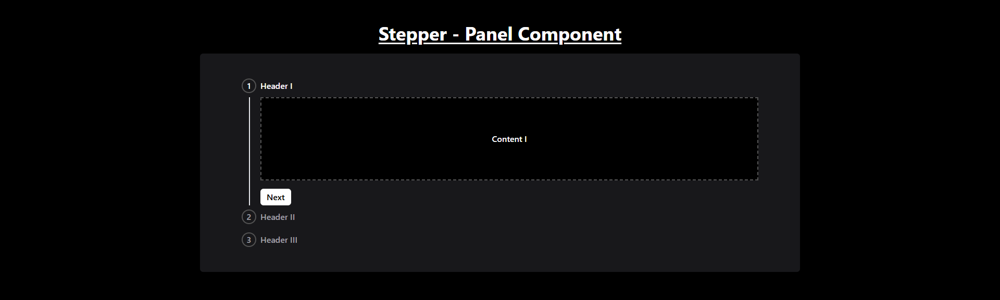

# Stepper Component

The stepper dynamically adapts to viewport width and can switch between horizontal and vertical orientations based on screen size.

## Features

- Responsive design with horizontal and vertical orientations.
- Dynamically rendered step headers and content.
- Navigation controls for moving between steps.

