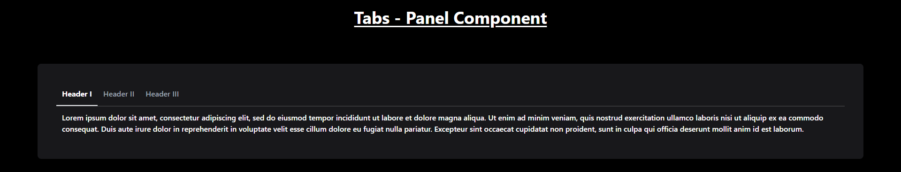
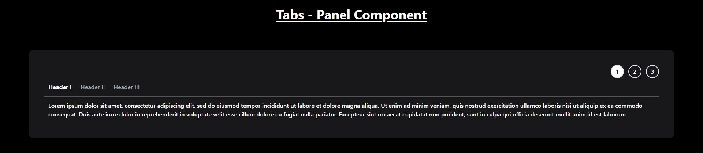

# Tabs Panel Component

This Tabs component supports keyboard navigation (arrow keys to switch tabs and Enter/Space to activate a tab) and can be easily integrated into your projects.

## Features

- **Tabbed Navigation**: Switch between different content sections by clicking the tab headers or using keyboard navigation.
- **Keyboard Accessibility**: Use the **ArrowLeft** and **ArrowRight** keys to navigate between tabs, and **Enter** or **Space** to select a tab.
- **Customizable Content**: Easily modify the content and titles of each tab.

